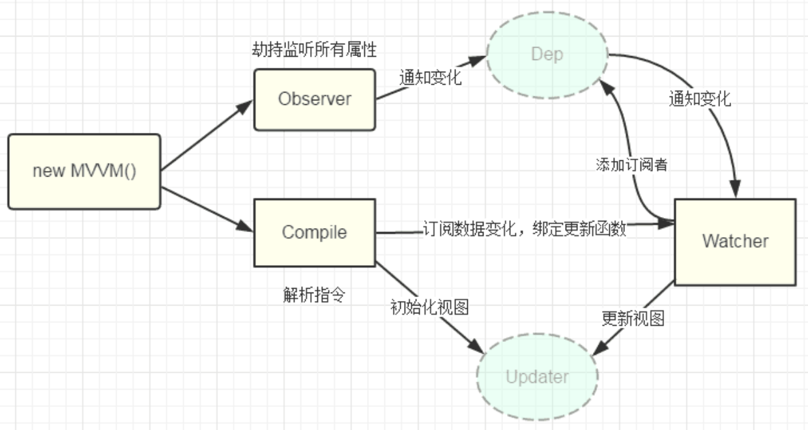
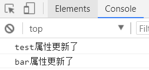
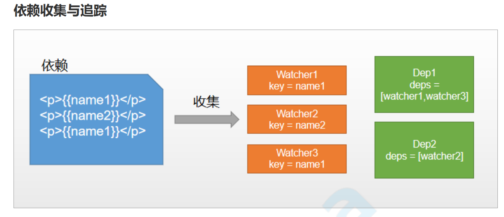
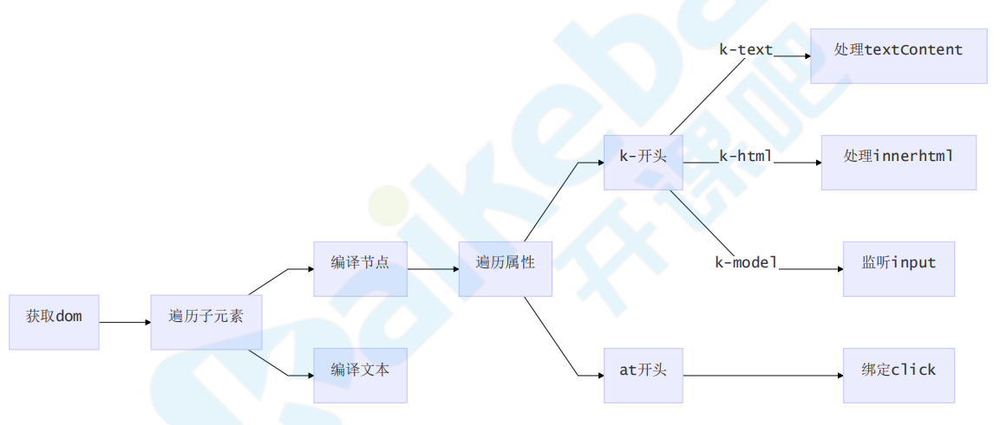

# 简版Vue1.x

## 架构图



## 实现Vue类

1. 数据响应化

   ```
   class Vue{
     constructor(options){
       // 保存传入选项
       this.$options = options
       this.$data = options.data
       // 响应化
       this.observe(this.$data)
     }
   
     observe(value){
       if(!value || typeof value !== "object"){
         return
       }
       // 遍历，执行数据响应式
       Object.keys(value).forEach(key=>{
         this.defineReactive(value, key, value[key])
         // 代理data中的属性到vue根上 
         this.proxyData(key);
       })
     }
   
     defineReactive(obj, key, val){
       // 递归
       this.observe(val)
       // 给obj定义属性
       Object.defineProperty(obj, key, {
         get(){
           return val
         },
         set(newVal){
           if(newVal === val) return
           val = newVal
           console.log(`${key}属性更新了`);
         }
       })
     }
   
     // 在vue根上定义属性代理data中的数据 
     proxyData(key) { 
       Object.defineProperty(this, key, { 
         get() { 
           return this.$data[key]; 
         },
         set(newVal) { 
           this.$data[key] = newVal;
         } 
       }); 
     }
   }
   ```

   ```
   <script>
     const app = new Vue({ 
       data: { 
         test: "I am test", 
         foo: { 
           bar: "bar" 
         } 
       }
     }); 
     app.$data.test = "hello, kaikeba!"; 
     app.$data.foo.bar = "oh my bar"; 
   </script>
   ```



2. 依赖收集

   

   ```
   // 负责管理所有Watcher,与key一一对应
   class Dep {
     constructor(){
       this.deps = []
     }
   
     addDep(dep){
       this.deps.push(dep)
     }
   
     notify(){
       // 通知所有watcher更新
       this.deps.forEach(dep => dep.update())
     }
   }
   ```

   ```
   // 负责创建data中key和更新函数的映射关系
   class Watcher {
     constructor(vm, key){
       this.vm = vm
       this.key = key
       Dep.target = this  // 把watcher实例附加到Dep静态属性上，new Watcher时候触发
     }
   
     update(){
       console.log(`${this.key}属性更新了`)
     }
   }
   ```

   开始依赖收集

   ```
   defineReactive(obj, key, val){
       ...
       // 创建Dep实例和key一一对应
       const dep = new Dep()
   
       // 给obj定义属性
       Object.defineProperty(obj, key, {
         get(){
           // 依赖收集,先判断当前key是否有watcher，有则加入dep管理起来
           Dep.target && dep.addDep(Dep.target)
           return val
         },
         set(newVal){
           ...
           dep.notify()	// 通知更新
         }
       })
     }
   ```

   ```
   constructor(options){
       ...
       // 依赖收集，测试代码
       new Watcher(this, "test")
       this.test	// 此处触发get进行依赖收集
     }
   ```

   编译器，遍历模板，分析其中哪些地方用到了data中的key以及事件等指令，此时认为是一个依赖，创建一个Watcher实例，使界面中的dom更新函数和那个key挂钩，如果更新了key，则执行这个更新函数

   

   ```
   class Compiler {
     // el: 宿主元素选择器
     // vm: Vue实例
     constructor(el, vm){
       this.$vm = vm;
       this.$el = document.querySelector(el)
   
       // 执行编译
       this.compile(this.$el)
     }
   
     compile(el){
       const childNodes = el.childNodes
       Array.from(childNodes).forEach(node=>{
         // 判断节点类型
         if(this.isElement(node)){
           // 元素<div></div>
           // console.log('编译元素：', node.nodeName)
           this.compileElement(node)
         }else if(this.isInter(node)){
           // 插值文本{{xxx}}
           // console.log('编译插值文本：', node.textContent)
           this.compileText(node)
         }
         // 递归可能存在的子元素
         if (node.childNodes && node.childNodes.length > 0) { 
           this.compile(node); 
         }
       })
     }
   
     isElement(node){
       return node.nodeType === 1
     }
     
     isInter(node){
       return node.nodeType === 3 && /\{\{(.*)\}\}/.test(node.textContent)
     }
   
     // 编译插值文本
     compileText(node){
       // {{xxx}}
       // node.textContent = this.$vm[RegExp.$1]
       this.update(node, RegExp.$1, 'text')
     }
   
     // 负责更新dom，同时创建watcher实例在两者之间挂钩
     update(node, exp, dir){
       // 首次初始化
       const updaterFn = this[dir+'Updater']
       updaterFn && updaterFn(node, this.$vm[exp])
       // 更新
       new Watcher(this.$vm, exp, function(value){
         updaterFn && updaterFn(node, value)
       })
     }
     textUpdater(node, value){
       node.textContent = value
     }
   
     htmlUpdater(node, value){
       node.innerHTML = value
     }
   
     modelUpdater(node, value){
       node.value = value
     }
   
     compileElement(node){
       // 获取属性
       const nodeAttrs = node.attributes
       Array.from(nodeAttrs).forEach(attr=>{
         const attrName = attr.name  // k-text
         const exp = attr.value    // exp
   
         if(this.isDirective(attrName)){
           // 截取指令名字
           const dir = attrName.substring(2) // text
           // 执行相应更新函数
           this[dir] && this[dir](node, exp)
         }
         // 事件处理
         if(this.isEvent(attrName)){
           // @click="onClick"
           const dir = attrName.substring(1)
           this.eventHandler(node, exp, dir)
         }
       })
     }
   
     isDirective(attr){
       return attr.indexOf('k-') === 0
     }
   
     isEvent(attr){
       return attr.indexOf('@') === 0
     }
   
     text(node, exp){
       this.update(node, exp, 'text')
     }
   
     html(node, exp){
       this.update(node, exp, 'html')
     }
   
     model(node, exp){
       this.update(node, exp, 'model')
   
       // 事件监听
       node.addEventListener('input', e=>{
         this.$vm[exp] = e.target.value
       })
     }
   
     eventHandler(node, exp, dir){
       const fn = this.$vm.$options.methods && this.$vm.$options.methods[exp]
       if(fn){
         node.addEventListener(dir, fn.bind(this.$vm))
       }
     }
   }
   ```

   ```
   class Vue {
     constructor(options){
       ...
       // new Watcher(this, "test")
       // this.test
       new Compiler(options.el, this)
   
       // 执行一下钩子
       if(options.created){
         options.created.call(this)
       }
     }
   }
   
   class Watcher {
     contructor(vm, key, cb){
       ...
       this.cb = cb
       Dep.target = this  // 把watcher实例附加到Dep静态属性上
       this.vm[this.key] // 触发依赖收集
       Dep.target = null
     }
     
     update(){
       // console.log(`${this.key}属性更新了`)
       this.cb.call(this.vm, this.vm[this.key])
     }
   }
   ```

   

   